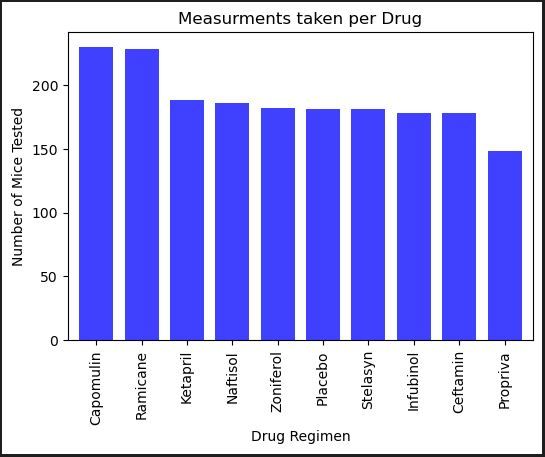
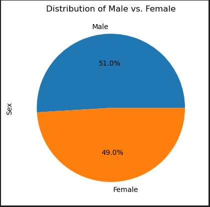
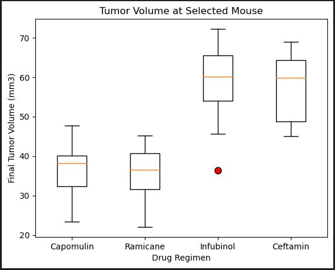
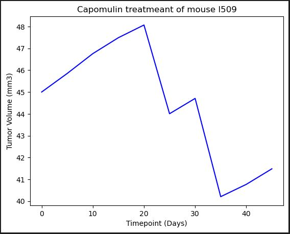
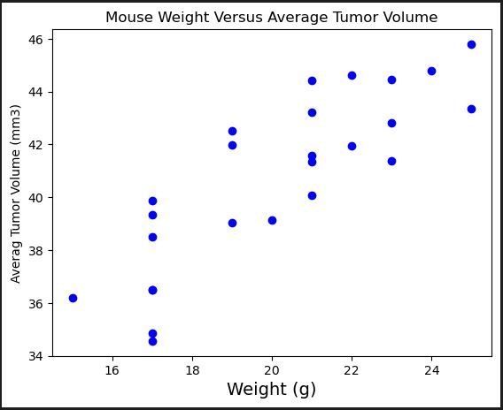
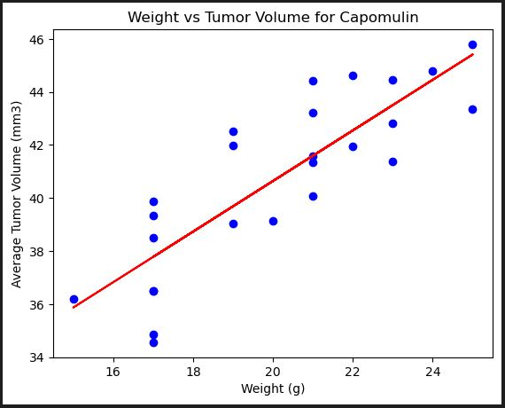

# Matplotlib-Challenge
## Background

I am a senior data analyst in a pharmaceutical company, current working on analyzing the effect of our skin cancer medicine Capomulin on mice. 

249 mice who were identified with squamous cell carcinoma(scc) tumors received treatment with a range of drug regimens. Over the course of 45 days, tumor development was observed and measured. The purpose of this study was to compare the performance of Pymaceuticals' drug of interest, Capomulin, against the other treatment regiments.

The management has requested me to analyze the clinical study data and generate a technical report.

- Files: Two CSV files were provided(mouse data and study results). I merged them using outer join and removed duplicates.

## Bar Chart 

A bar plot showing the total number of timepoints for all mice tested for each drug regimen using pyplot

## Pie Chart

Pie plot showing the distribution of female versus male mice using Pandas

## Quartiles, Outliers, and Boxplots

 A box plot showing the distrubution of the tumor volume for each treatment group.

 

## Lint Plot

A line plot of tumor volume vs. time point for a mouse treated with Capomulin

## Scatter Plot

A scatter plot of average tumor volume vs. mouse weight for the Capomulin regimen

## Correlation and Regression

Correlation coefficient and linear regression model 
for mouse weight and average tumor volume for the Capomulin regimen

